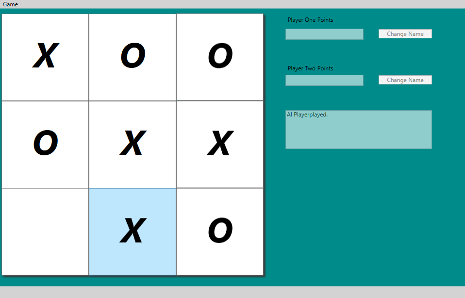
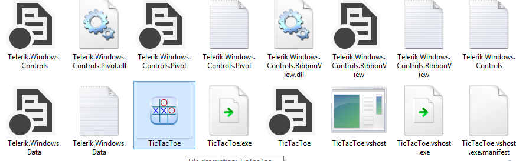
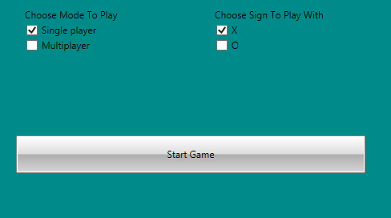

#Description

Standart version of the classic Tic Tac Toe game made on C#.

##How to use

The main reason I created that game was because I will always remember the games i played with my friends when I was young. I hope you like it just like me or at least give it a try

* Supports almost all of the Windows
* Just start and go
* Can be played vs other player
* Smart AI

### Installation

1. I'ts already installed and configured!

#### Example Usage

1. Open "bin" folder

2. Open Debug

3. Start the .exe file

4. You will see that window

5. Chouse your mode and try to beat the AI

## Requirements

* Windows
* Time

## Contact

[Dimitar Jilanov](http://jilanov.com)   
[@DimitarJilanov](https://twitter.com/DimiturJilanov)

## License

Tic Tac Toe is available under the MIT license. See the LICENSE file for more info.
